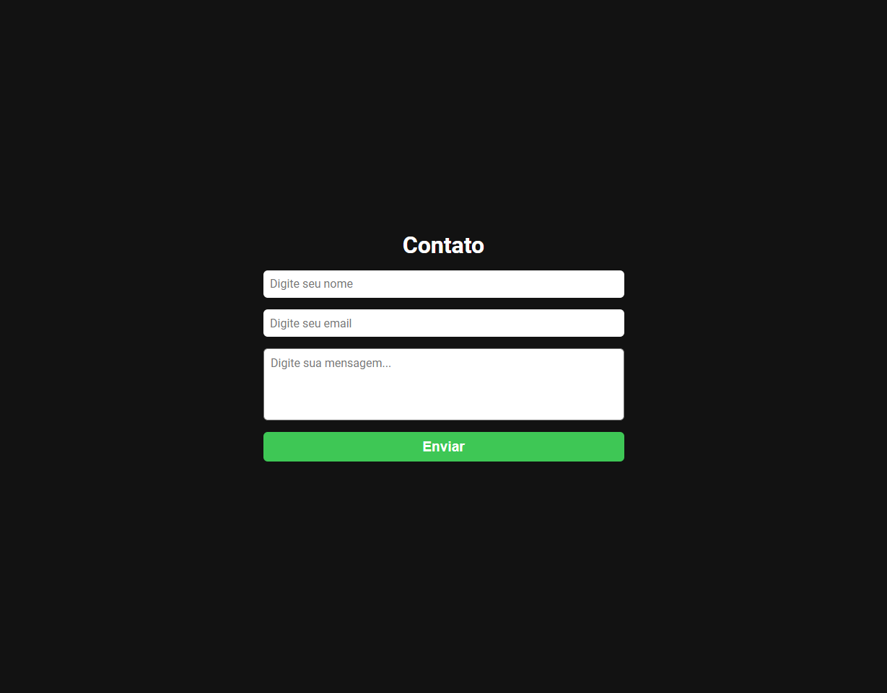

<h1 align="center"> Formulário Email</h1>

Projeto de validação de formulário.

  <a href="#-tecnologias">Tecnologias</a>&nbsp;&nbsp;&nbsp;|&nbsp;&nbsp;&nbsp;
  <a href="#-projeto">Projeto</a>&nbsp;&nbsp;

 

  

## 🚀 Tecnologias

Esse projeto foi desenvolvido com as seguintes tecnologias:

- ReactJs
- EmailJs
- Git e Github
 

## 💻 Projeto

Essa aplicação tem como propósito, fazer uma validação diretamente ao email, usando o EmailJs você consegue vincular seu email. Fazendo com que todas as mensagens vão direto a sua caixa de entrada.

[🔗 Clique aqui para acessar](https://projetoflix-api.vercel.app/)

---

Feito com ♥ by Daniel Kyochi 🌍

